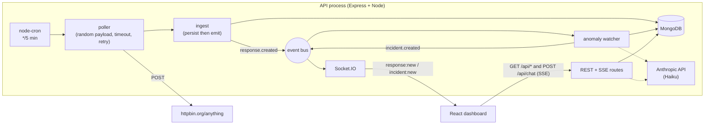

# HTTP Monitor

A full-stack application that pings `httpbin.org/anything` every 5 minutes with a
random JSON payload, stores each response in MongoDB, streams new results to a
real-time dashboard, and layers **LLM-powered insights** on top: automatic incident
detection, a natural-language chat over the monitoring data, and payload analysis —
all with strict cost controls.

Built for the BizScout Full Stack Engineer take-home test.

> **AI Enhancement implemented: Option B — LLM-Powered Insights.**

---

## Table of contents

- [Tech stack & why](#tech-stack--why)
- [Architecture](#architecture)
- [Core components & testing strategy](#core-components--testing-strategy)
- [Option B — LLM insights](#option-b--llm-insights)
- [Cost analysis](#cost-analysis)
- [Running locally](#running-locally)
- [API reference](#api-reference)
- [Deployment](#deployment)
- [Assumptions & shortcuts](#assumptions--shortcuts)
- [Future improvements](#future-improvements)

---

## Tech stack & why

| Layer        | Choice                                   | Reasoning                                                                                                                                              |
| ------------ | ---------------------------------------- | ---------------------------------------------------------------------------------------------------------------------------------------------------- |
| **Stack**    | MERN (MongoDB, Express, React, Node) + TypeScript end-to-end | One language across the stack; shared mental model; TypeScript catches the integration mistakes a take-home is most likely to ship.            |
| **Backend**  | Express + TypeScript                     | Preferred option in the brief. Small, explicit, no framework magic to explain. Structured into modules with an event bus so boundaries stay visible.  |
| **Database** | MongoDB (Mongoose)                       | Responses are arbitrary, schemaless JSON payloads — document-shaped by nature. Relations are shallow (incident → response by id). Time-range history and rolling stats are served by indexes + the aggregation pipeline (`$avg`, `$percentile`). |
| **Realtime** | Socket.IO (dashboard) + SSE (LLM chat)   | Socket.IO is the canonical MERN realtime layer with reconnect built in — right for fan-out broadcast. The chat streams token-by-token over Server-Sent Events, which fits a one-way per-request stream better than multiplexing through the socket. |
| **Frontend** | React + Vite + TanStack Query + Tailwind | Preferred option in the brief. TanStack Query gives loading/error/empty states and a cache that realtime events patch directly (no refetch storms). |
| **LLM**      | Claude Haiku 4.5 via the Anthropic SDK   | Cheapest capable model for structured, high-frequency monitoring queries; tool use keeps query construction safe.                                     |
| **Tests**    | Vitest + Supertest + mongodb-memory-server + Testing Library | One runner across both workspaces. Integration tests hit a real in-memory MongoDB, so aggregation behaviour is tested for real, not mocked. |

A monorepo (npm workspaces: `apps/api`, `apps/web`) keeps both halves in one repo with
one install and shared tooling, while still building and deploying independently.

## Architecture

A **modular monolith**: one Node process runs the poller, the REST API, and the
Socket.IO server. Modules are decoupled through an in-process event bus, so the
boundaries that would become network seams in a larger system are already visible.



**Why a monolith (and its trade-offs).** At this scale — one endpoint, 288
requests/day, a handful of dashboard clients — a monolith is the honest choice:
one deploy, one log stream, atomic persist-then-broadcast, no cross-service failure
modes. The cost is shared fate (a poller crash could take the API down — mitigated
with per-tick `try/catch` and global handlers) and scale-as-a-unit (a second instance
would double the cron and break the in-process socket fan-out). The escape hatch is
designed in, not bolted on — see [Future improvements](#future-improvements).

### Request & data flow

1. `node-cron` fires every 5 minutes → **poller** generates a random JSON payload,
   POSTs it to httpbin with a 10s timeout and one retry, and captures status, latency,
   body, and size. Failures become records too.
2. **ingest** persists the record, then emits `response.created`. Persist-then-emit
   ordering guarantees a client that refetches on the event always finds the row.
3. The **realtime** module broadcasts `response:new`; the **anomaly watcher** checks
   the record against the rolling baseline and may create an incident.
4. The React app holds history in TanStack Query and patches the cache directly from
   socket events.

## Core components & testing strategy

The brief asks us to identify the core components and deeply test **one**.

**Identified core components**

1. **Poller + ingest chain** — *the* core. It is the product: if payload generation,
   timing, error handling, or persistence is wrong, every downstream feature is wrong.
2. **REST query layer** — how all historical data reaches clients.
3. **Realtime broadcast** — the "real-time" half of the brief.

**Deeply tested: the poller + ingest chain** (plus the anomaly + cost logic that the
AI features hinge on). Coverage of the core chain (poller, payload, ingest, repo,
routes) is **100% of lines**; uncovered code is bootstrap glue (server wiring, DB
connect) that integration tests exercise indirectly.

| Suite                       | Type        | What it proves                                                                              |
| --------------------------- | ----------- | ------------------------------------------------------------------------------------------- |
| `poller.test.ts`            | Unit        | Success, non-2xx as error, retry-then-success, double failure, non-JSON body, >100 KB truncation, POST payload contract |
| `payload.test.ts`           | Unit        | JSON-serializable envelope; deterministic under an injected RNG                             |
| `anomaly.test.ts`           | Unit        | Threshold at 2x, critical at 3x, min-sample and zero-baseline guards                         |
| `costGuard.test.ts`         | Unit        | Sliding-window limiter, TTL cache, token estimation, Haiku pricing                          |
| `ingest.test.ts`            | Integration | Real in-memory Mongo; persist-**before**-emit ordering verified explicitly                  |
| `response.routes.test.ts`   | Integration | Pagination, ordering, filters, 400/404/malformed-id, stats math (avg, error rate, p95)      |
| `ConnectionIndicator`, `StatsCards` | Component | Connection states; loading → success → error rendering with a mocked API            |

CI (GitHub Actions) runs format check → lint → typecheck → tests with coverage on
every push/PR, and uploads the coverage report as an artifact.

## Option B — LLM insights

Four capabilities, each built to **degrade gracefully** — with no `ANTHROPIC_API_KEY`,
every feature still works via a non-LLM fallback.

1. **Natural-language chat** (`POST /api/chat`, streamed over SSE). Claude Haiku
   answers questions like *"What were the slowest response times today?"*. Crucially,
   **the LLM never writes database queries** — it can only call one of four predefined,
   parameter-validated tools (`get_slowest_responses`, `get_error_summary`, `get_stats`,
   `get_responses_around`). This rules out query injection and hallucinated fields *by
   construction*. Answers stream token-by-token.
2. **Automatic incident reporting.** Every response is checked against a rolling
   1-hour baseline. When latency exceeds 2x the average (3x = critical), an incident is
   created with timestamp, severity, endpoint, and LLM-suggested root causes +
   recommendations. A 15-minute cooldown and a minimum-sample guard prevent storms and
   false positives on a cold start.
3. **Smart response analysis.** Aggregates recent payloads (status codes, body types,
   sizes) and asks the LLM for a short natural-language summary of patterns. Cached 30
   minutes.
4. **Cost optimization.** Pre-call token estimation with a hard cap; a 15-minute answer
   cache keyed on the normalized question; a sliding-window limit of **20 LLM calls/hour**
   shared across all three features; a keyword-intent fallback when the quota is spent or
   no key is set; and per-call usage tracking surfaced in the dashboard. See below.

## Cost analysis

Pricing — **Claude Haiku 4.5**: **$1 / 1M input tokens**, **$5 / 1M output tokens**.

Typical chat question (2 API calls — tool selection, then the streamed answer):

| Call             | Input tokens | Output tokens | Cost         |
| ---------------- | ------------ | ------------- | ------------ |
| Tool selection   | ~700         | ~80           | ~$0.0011     |
| Final answer     | ~1,200       | ~200          | ~$0.0022     |
| **Per question** |              |               | **~$0.0033** |

At the **20 calls/hour** cap (~10 questions/hour), the worst case is **~$0.033/hour ≈
$0.79/day ≈ $24/month** — and that is the ceiling, not the expectation, because:

- **Caching** — repeated/similar questions return for $0 within the TTL window.
- **Shared budget** — incidents and analysis draw from the same 20/hour pool, so total
  spend is bounded regardless of which feature is active.
- **Pre-call estimation** — oversized prompts are rejected before any spend.
- **Fallbacks** — once the quota is hit, answers come from rule-based templates at $0.

Live spend (tokens in/out, total USD, calls remaining this hour) is shown in the
dashboard cost panel and served by `GET /api/llm/usage`.

## Running locally

**Prerequisites:** Node 20+, Docker (for local MongoDB), and optionally an Anthropic
API key.

```bash
# 1. Install (both workspaces)
npm install

# 2. Start MongoDB
docker compose up -d

# 3. Configure env
cp .env.example apps/api/.env       # edit if needed; ANTHROPIC_API_KEY is optional

# 4. Run API and web (two terminals)
npm run dev:api      # http://localhost:3001
npm run dev:web      # http://localhost:5173
```

The dashboard polls a fresh response on boot, then every 5 minutes. To see data fast,
set `POLL_CRON="* * * * *"` (once a minute) in `apps/api/.env`.

**Without an API key:** the AI tabs still work — chat uses keyword-intent fallbacks,
incidents and analysis use rule-based text. Set `ANTHROPIC_API_KEY` to enable the LLM
path; it is picked up automatically.

**Useful scripts** (run from the repo root):

```bash
npm test                  # all tests, both workspaces
npm run test:coverage     # with coverage
npm run lint              # eslint across the monorepo
npm run format            # prettier --write
npm run build             # build both apps
```

Environment variables are documented in [`.env.example`](.env.example).

## API reference

| Method & path               | Description                                                       |
| --------------------------- | ---------------------------------------------------------------- |
| `GET /health`               | Liveness probe                                                   |
| `GET /api/responses`        | Paginated history. Query: `from`, `to`, `status=ok\|error`, `page`, `limit` |
| `GET /api/responses/:id`    | Single response                                                  |
| `GET /api/stats`            | Aggregate stats (count, error rate, avg, p95). Query: `from`, `to` |
| `POST /api/chat`            | NL question → **SSE stream** (`token` / `done` / `error` events). Body: `{ "question": "..." }` |
| `GET /api/incidents`        | Paginated incident reports                                       |
| `GET /api/insights/summary` | LLM/rule-based payload analysis. Query: `hours`                  |
| `GET /api/llm/usage`        | Token + cost totals and remaining hourly quota                  |

**Socket.IO events (server → client):** `response:new`, `incident:new`.

The full database schema is in [`docs/SCHEMA.md`](docs/SCHEMA.md).

## Deployment

The two halves deploy independently.

**API → Railway** (Docker, always-on process for the cron poller + sockets):

1. New project → **Deploy from GitHub repo**. Railway reads [`railway.json`](railway.json)
   and builds the [`Dockerfile`](Dockerfile).
2. Set variables: `MONGO_URL` (Atlas connection string), `CORS_ORIGIN` (your Vercel URL),
   optionally `ANTHROPIC_API_KEY`. Railway injects `PORT` automatically; health check is `/health`.
3. Generate a public domain for the service and note its URL — it becomes the frontend's
   `VITE_API_URL`.

> **Why Railway for the API:** the poller is an always-on `node-cron` process, so the API
> can't be serverless. Railway runs it continuously with no idle sleep — unlike some free
> tiers (e.g. Render) that sleep after ~15 min idle and would pause polling. This is the
> one genuinely operational constraint of the in-process scheduler.

**Database → MongoDB Atlas:** free M0 cluster; copy the SRV connection string into
`MONGO_URL`. (Atlas M0 is a replica set, which also enables the change-streams upgrade
path described below.)

**Frontend → Vercel:** import the repo; [`vercel.json`](vercel.json) sets the build
(`npm run build -w apps/web`), output dir, and SPA rewrites. Set `VITE_API_URL` to the
deployed API URL.

## Assumptions & shortcuts

- **Lost ticks on restart are acceptable.** The in-process scheduler isn't persistent;
  a redeploy may skip one tick. At a 5-minute cadence this is immaterial and documented
  rather than engineered around.
- **No authentication.** The brief describes an internal monitoring tool; auth is listed
  as a future improvement, not built.
- **Response bodies are capped at 100 KB** and stored as a truncation marker beyond that,
  to keep documents bounded.
- **The 4-char-per-token estimate** is a deliberately cheap pre-call heuristic; actual
  billed usage comes from the API response and is what gets persisted.
- **`p95` uses MongoDB `$percentile`** (requires MongoDB ≥ 7.0; the test harness pins
  7.0.14 to match).
- **Single-instance assumption** for the in-process event bus and cron (see below).

## Future improvements

- **Worker + API split (the primary scale path).** Move the poller into its own process
  that writes to MongoDB; the API process subscribes to a **MongoDB change stream** (or
  Redis pub/sub) to drive the socket broadcast. This removes shared fate, lets the API
  scale horizontally without duplicating the cron, and survives an API redeploy without
  missing a tick. The current in-process event bus is the seam this slots into.

  ```mermaid
  flowchart LR
    subgraph W["Poller worker"]
      C["node-cron"] --> P["poll"] --> DBW[(MongoDB)]
    end
    subgraph A["API (scalable, N instances)"]
      CS["change stream / Redis sub"] --> RT["Socket.IO"]
      REST["REST + SSE"] --> DBR[(MongoDB)]
    end
    DBW -. "change stream" .-> CS
    RT --> WEB["dashboard"]
  ```

- **Persistent / distributed scheduling** — BullMQ (Redis) or Agenda (Mongo-backed) for
  retries, history, and a single cron across instances.
- **Authentication & multi-tenant monitoring** of arbitrary user-supplied endpoints.
- **Richer time-series visualization** — latency charts with the rolling average and
  anomaly markers overlaid (this leans toward Option A's territory).
- **Embeddings-based semantic search** over payloads (Option C territory).
- **Alerting integrations** — push incidents to Slack / PagerDuty / email.
